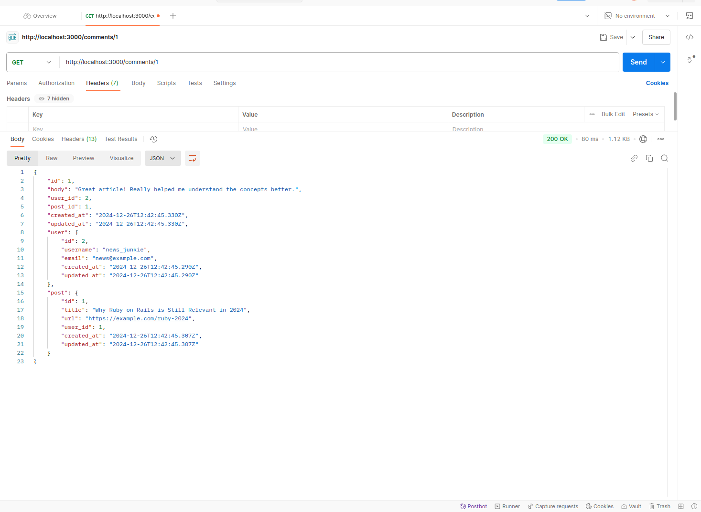

# Micro-Reddit API

Micro-Reddit is a lightweight API built with Ruby on Rails, enabling users to create posts, comment on posts, and interact through associations. This project demonstrates fundamental concepts of data modeling, validations, and associations in Rails.

## **Project Overview**
You can attach an image or diagram to illustrate the relationships among models (Users, Posts, Comments). Place the image in the `assets` folder and reference it in the README:

Example:


---

## **Features**
- **User Management**: Create and validate users with unique usernames.
- **Post Submission**: Users can submit posts with validations for content.
- **Commenting System**: Users can comment on posts (not on other comments).
- **Data Associations**:
  - Users have many posts and comments.
  - Posts belong to a user and have many comments.
  - Comments belong to a user and a post.

---

## **Getting Started**

### **Prerequisites**
- Ruby (>= 8)
- Rails (>= 6.1)
- SQLite3 (default database)

---

### **Setup Instructions**

1. Clone the repository:
   ```bash
   git@github.com:fabortwell/micro-reddit.git
   cd micro-redit
   ```

2. Install dependencies:
   ```bash
   bundle install
   ```

3. Set up the database:
   ```bash
   rails db:create
   rails db:migrate
   ```

4. Start the Rails server:
   ```bash
   rails server
   ```

5. Test the setup:
   Open the Rails console:
   ```bash
   rails console
   ```
   Run:
   ```ruby
   User.all
   ```
   You should see an empty array `[]`.

---

## **Data Models and Migrations**

### **User Model**
- **Attributes**: `username` (string, unique, presence)
- **Associations**: 
  - `has_many :posts`
  - `has_many :comments`

### **Post Model**
- **Attributes**: `title` (string, presence), `body` (text, presence), `user_id` (integer, foreign key)
- **Associations**: 
  - `belongs_to :user`
  - `has_many :comments`

### **Comment Model**
- **Attributes**: `body` (text, presence), `user_id` (integer, foreign key), `post_id` (integer, foreign key)
- **Associations**: 
  - `belongs_to :user`
  - `belongs_to :post`

---

## **Validations**

### **User Validations**
- `username`:
  - Must be present.
  - Must be unique.
  - Length must be between 3 and 20 characters.

### **Post Validations**
- `title`: Must be present.
- `body`: Must be present.

### **Comment Validations**
- `body`: Must be present.
- `user_id`: Must be present.
- `post_id`: Must be present.

---

## **Playing in Rails Console**

### **User Operations**
- Create a new user:
  ```ruby
  User.create(username: "example_user")
  ```
- Check validations:
  ```ruby
  u = User.new
  u.valid? # false
  u.errors.full_messages # Display validation errors
  ```

### **Post Operations**
- Create a post for a user:
  ```ruby
  user = User.first
  user.posts.create(title: "Post Title", body: "Post Content")
  ```

### **Comment Operations**
- Create a comment for a post by a user:
  ```ruby
  user = User.find(2)
  post = Post.first
  post.comments.create(body: "Great post!", user: user)
  ```

---

## **Associations and Queries**

### **User**
- Get all posts by a user:
  ```ruby
  user.posts
  ```
- Get all comments by a user:
  ```ruby
  user.comments
  ```

### **Post**
- Get the user who created the post:
  ```ruby
  post.user
  ```
- Get all comments on a post:
  ```ruby
  post.comments
  ```

### **Comment**
- Get the post associated with a comment:
  ```ruby
  comment.post
  ```
- Get the user who wrote the comment:
  ```ruby
  comment.user
  ```


